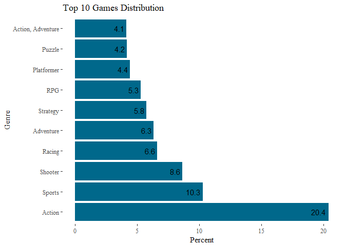
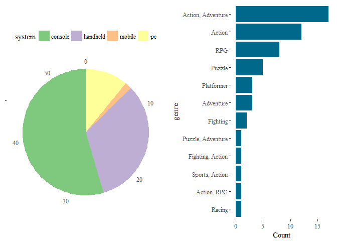

Introduction
------------

[IGN dataset
"20-years-of-games"](https://www.kaggle.com/egrinstein/20-years-of-games/data)
is the collection of over 18000 games title throughout 2 decades (1996 -
2016). While the dataset has only 9 variables/features which is not
suitable for predictive analysis, it offers us a way to take a snapshot
of how games progress year after year. The main variables we will use in
this long Exploratory Data Analysis are:

1.  score: The score of the game title
2.  score\_phrase: Ordinal variable describing the score
3.  title: title of the game
4.  platform: name of the platform of the game
5.  genre: genre of the game
6.  release\_year/month/day: the year, month, day the game was released
    respectively
7.  system: a more compact representation of platform

Loading libraries and dataset
-----------------------------

    library(tidyverse)
    library(ggplot2)
    library(GGally)
    library(ggthemes)
    library(corrplot)
    library(lubridate)
    library(RColorBrewer)
    library(gridExtra)
    library(scales)
    library(wordcloud)
    library(ngram)
    library(qdap)
    library(tm)

------------------------------------------------------------------------

Reading in the data from ign.
-----------------------------

    ign <- tbl_df(read.csv("ign.csv",stringsAsFactors = TRUE))

------------------------------------------------------------------------

Exploratory Data Analysis
-------------------------

    # Counting observations and overview of the dataset
    dim(ign)

    ## [1] 18625    11

    str(ign)

    ## Classes 'tbl_df', 'tbl' and 'data.frame':    18625 obs. of  11 variables:
    ##  $ X             : int  0 1 2 3 4 5 6 7 8 9 ...
    ##  $ score_phrase  : Factor w/ 11 levels "Amazing","Awful",..: 1 1 6 6 6 5 2 1 2 5 ...
    ##  $ title         : Factor w/ 12589 levels "'Splosion Man",..: 5702 5703 9767 7249 7249 11406 2908 4446 2908 11406 ...
    ##  $ url           : Factor w/ 18577 levels "/games/0-d-beat-drop/xbox-360-14342395",..: 8390 8387 14319 10813 10812 16931 4271 6526 4270 16932 ...
    ##  $ platform      : Factor w/ 59 levels "Android","Arcade",..: 39 39 15 58 36 20 58 33 36 33 ...
    ##  $ score         : num  9 9 8.5 8.5 8.5 7 3 9 3 7 ...
    ##  $ genre         : Factor w/ 113 levels "","Action","Action, Adventure",..: 65 65 70 95 95 106 39 83 39 106 ...
    ##  $ editors_choice: Factor w/ 2 levels "N","Y": 2 2 1 1 1 1 1 2 1 1 ...
    ##  $ release_year  : int  2012 2012 2012 2012 2012 2012 2012 2012 2012 2012 ...
    ##  $ release_month : int  9 9 9 9 9 9 9 9 9 9 ...
    ##  $ release_day   : int  12 12 12 11 11 11 11 11 11 11 ...

    # Counting missing values
    colSums(is.na(ign))

    ##              X   score_phrase          title            url       platform 
    ##              0              0              0              0              0 
    ##          score          genre editors_choice   release_year  release_month 
    ##              0              0              0              0              0 
    ##    release_day 
    ##              0

    ign <- na.omit(ign)

There is a very small subset of missing data (36 in 18625) which can be
removed without any effect on the analysis.

X variable which is an index and url variable which is a website for the
game can also be removed. To finish the cleaning process, we will
transform score\_phrase to factor. One unsual data point is te game
released in 1970 which will be removed for most analysis but we will
come back and play with it later.

    ign <- ign %>%
        select(-X, -url) %>%
        mutate(title = as.character(title)) %>%
        mutate(genre = factor(genre, 
                              levels = names(sort(table(genre), decreasing=TRUE))))

------------------------------------------------------------------------

Genre Analysis
--------------

    top10 <- head(names((sort(table(ign$genre), decreasing = TRUE))), 10)

    ign %>%
        filter(genre %in% top10) %>%
        group_by(genre) %>%
        summarize(percentage = n()/nrow(ign)) %>%
        ggplot(aes(x = genre, y = percentage * 100)) + 
        geom_col(fill = "deepskyblue4") +
        coord_flip() + 
        labs(x = "Genre", y = "Percent", title = "Top 10 Games Distribution") +
        theme_tufte() +
        geom_text(aes(label = round(percentage*100, digits = 1)), hjust = 1.2)

Unsurprisingly, Action genre is the predominant genre for gaming. Lets
observe to see if this trend change over the year

    ign %>%
        filter(genre %in% top10, release_year >= 1996) %>%
        group_by(genre, release_year) %>%
        summarize(count = n()) %>%
        ggplot(aes(x = release_year, y = count, group = genre, fill = genre)) + 
        geom_area(position = "fill") + theme_tufte() + scale_fill_brewer(palette = "Paired") +
        labs(title = "Genre Distribution by Years", x = "Year", y = "Percentage of top 10")

Up until 2015, Action genre is dominating the gaming industry. However,
Adventure Shooter, and RPG starts to take over around 2012. This trend
can be explained with the release of various big titles in Adventure and
RPG genre such as Call of Duty, The Witcher, Skyrim, Fallout, WOW
expansions...The esport scene of Shooter games and wide spread of
console are also correlated with this trend. (analysis below)

Notice that this is not a US only dataset hence Sport genre is not as
popular. [US most
popular](https://www.statista.com/statistics/189592/breakdown-of-us-video-game-sales-2009-by-genre/)

Now, lets take a look at how genre corellated to score.

    ign %>%
        filter(genre %in% top10, release_year >= 1996) %>%
        group_by(genre, release_year) %>%
        summarize(average_score = mean(score, na.rm = TRUE)) %>%
        ggplot(aes(x = release_year, y = average_score, col = genre)) +
        geom_smooth(method = "lm", se = FALSE) +
        theme(axis.title.x = element_blank()) +
        theme_tufte() +
        labs(y = "Average Score", title = "Average Score of top 10 genres through time", x ="") +
        scale_color_brewer(palette = "Paired")

The plot is quite noisy due to big jumps in the rating year by year
which suggests rating depends on the game title more than its genre.
Nevertheless the data show that game ratings is increased slightly as a
whole overtime except for Action, Adventure games whose rating keep
declining!

    ign %>%
        filter(genre %in% top10, release_year >= 1996) %>%
        ggplot(aes(x = genre, y = score, col = genre)) +
        geom_boxplot() +
        theme_tufte() +
        theme(legend.position = "none", axis.text.x = element_text(angle = 45)) +
        labs(title = "Top 10 genres score boxplot", y = "Score", x = "Genre")

------------------------------------------------------------------------

#### Genre Conclusion

While gaming genre distribution is widely different, their rating is
very similar. Perhaps platform will have a bigger impact on rating.

------------------------------------------------------------------------

Time Analysis
-------------

In this section, we will walk through various plots to show the effect
of time on rating and release schedule. Since 11 categories of
score\_phrase are too overcrowded, we will reduce it into 5 groups:
Masterpiece, Good, Okay, Bad and Disaster

    library(plyr)
    ign$score_phrase <- revalue(ign$score_phrase, 
                                c("Amazing" = "Good", "Great" = "Good", "Mediocre" = "Okay", 
                                  "Awful" = "Bad", "Painful" = "Bad", "Unbearable" = "Disaster"))
    ign$score_phrase <- factor(ign$score_phrase, 
                               levels = c("Masterpiece", "Good", "Okay", "Bad", "Disaster"))
    plot2 <- ign %>%
        filter(release_year >= 1996) %>%
        ggplot(aes(x = release_year, fill = score_phrase)) +
        geom_density(position = "stack") + 
        scale_fill_brewer(palette = "Blues") + 
        theme_tufte() +
        labs(x = "Year") 
    plot1 <- ign %>%
        filter(release_year >= 1996) %>%
        ggplot(aes(x = release_month, fill = score_phrase)) +
        geom_density(position = "stack") + 
        scale_fill_brewer(palette = "Blues") + 
        theme_tufte() +
        scale_x_continuous(breaks = 1:12, labels = month.abb) +
        theme(legend.position = "none") +
        labs(x = "Months")
    grid.arrange(plot1, plot2)

The year 2008 saw a massive games titles releases. From then, it is
slowly decreasing. However, we see that more masterpieces are being
produced while bad and disaster games are becoming obsolete. This is a
big change in the industry standard where only good games can survive
(Does this have any correlation with EA buying game licenses?)

Also note the jump in game titles release in October, November. This
jump can be explained by Fall holidays, back to school day...

    detach("package:plyr", unload=TRUE)
    ign %>%
        filter(release_year >= 1996) %>%
        unite("date", starts_with("release")) %>%
        mutate(date = ymd(date)) %>%
        ggplot(aes(x = date, y = score)) +
        stat_bin_hex() +
        scale_fill_gradient(high = "red", low = "#132B43") +
        theme_tufte() +
        theme(axis.title.x = element_blank()) +
        labs(title = "Heat map of game rating through time", y = "Score")

    hand_console <- c("PlayStation Vita", "Nintendo DS", "Nintendo 3DS", 
                      "PlayStation Portable", "Lynx", "Game Boy", "Game Boy Color",
                      "NeoGeo Pocket Color", "Game.Com", "Dreamcast VMU", "WonderSwan", 
                      "WonderSwan Color", "Game Boy Advance", "N-Gage", "Nintendo DSi",
                      "New Nintendo 3DS")
    mobile <- c("iPad","iPhone", "Android", "iPod", "Windows Phone", "Windows Surface")
    console <- c("Xbox 360", "PlayStation 3", "Wii", "PlayStation 4", "Wii U", "PlayStation",
                 "Nintendo 64", "Saturn", "Dreamcast", "Arcade", "Nintendo 64DD", 
                 "PlayStation 2", "Xbox", "GameCube", "NES", "Genesis", "TurboGrafx-16",
                 "Super NES", "NeoGeo", "Master System", "Atari 5200", "Atari 2600", 
                 "Sega 32X", "Vectrex", "Sega CD", "Xbox One", "Ouya", "Wireless")
    pc <- c("Macintosh", "PC", "Linux", "DVD / HD Video Game", "Pocket PC", "TurboGrafx-CD",
            "Commodore 64/128", "Web Games", "SteamOS")

    ign <- ign %>%
        mutate(system = ifelse(platform %in% hand_console, "handheld", 
                               ifelse(platform %in% mobile, "mobile",
                                      ifelse(platform %in% console, "console", "pc"))))
    ign$system <- as.factor(ign$system)
    ign %>%
        filter(release_year >= 1996) %>%
        ggplot(aes(x = release_year, fill = system)) +
        geom_density(position = "fill") +
        theme_tufte() +
        theme(axis.title.x = element_blank()) + 
        labs(title = "Density Plot of games title release for each system through time",
             y = "Percent")

Note that the game titles distribution across platform also correlated
with its popularity (ie: more devs, more playerbase).[For more
information](https://www.statista.com/chart/4527/game-developers-platform-preferences/)
The rise and fall of many platforms are fascinating. We see the fall of
PC and handheld for much of 2000 - 2010. This period also witnessed the
rise of mobile game. It is no coincidence that smartphones and tablets
are becoming widespread in this period also.

However, after 2010, PC rised and took over the gaming market. There are
many factors contribute to this rise:

1.  Esport by this time has reached a new height with the release of
    League of Legends.
2.  Steams offered digital distribution of a massive library of indie
    game titles which in turn attract more devs.
3.  Graphic cards' prices were getting lower than ever.
4.  Social media allowed people to share the experience.
5.  Console took a massive amount of advertising to return the profit
    compare to the seasoned PC fan base.

Lastly, lets take a book at score distribution

    ign %>%
        filter(release_year >= 1996) %>%
        ggplot(aes(x = score, color = system)) +
        geom_freqpoly(bins = 21) +
        theme(legend.position = "none") +
        geom_vline(xintercept = mean(ign$score, na.rm = TRUE), linetype = 2, size = 2) +
        theme_tufte() +
        labs(title = "Distribution of game rating across game system")

The distribution of rating is consistent across all system, centers
around 7-8 range.

------------------------------------------------------------------------

Masterpieces and title analysis
-------------------------------

Lets take a look at the masterpieces

    masterpiece <- filter(ign, score_phrase == "Masterpiece")
    plot1 <- masterpiece %>%
        group_by(system) %>%
        summarize(count = n()) %>%
        ggplot(aes(x = "", y = count, fill = system)) +
        geom_col(width = 1) +
        coord_polar("y", start = 0) +
        scale_fill_brewer(palette = "Accent") +
        theme_tufte() +
        theme(axis.title.x = element_blank(), axis.title.y = element_blank(), 
              legend.position = "top")
    plot2 <- masterpiece %>%
        mutate(genre = factor(genre, 
                              levels = names(sort(table(genre), decreasing=FALSE)))) %>%
        group_by(genre) %>%
        summarize(count = n()) %>%
        ggplot(aes(x = genre, y = count)) +
        geom_col(fill = "deepskyblue4") +
        coord_flip() +
        theme_tufte() +
        labs(y = "Count")
    grid.arrange(plot1, plot2, nrow = 1)

It is quite surprising how many masterpieces hand held system has given
its limited titles. Perhaps nostalgia has a big influence on this
number. Action, Adventure and RPG occupy many of the slot while there is
not a single Strategy masterpiece!

Lets see if wordcloud offer us anymore insight

    title_masterpiece <- concatenate(masterpiece$title)

    clean <- function(x){
        x <- replace_contraction(x)
        x <- removePunctuation(x)
        x <- tolower(x)
        x <- removeWords(x, stopwords("en"))
    }

    title_masterpiece <- clean(title_masterpiece)
    uni_gram <- ngram(title_masterpiece, n = 1)
    freq <- get.phrasetable(uni_gram)

    wordcloud(freq$ngrams, freq$freq, random.order=FALSE, rot.per=0.35, 
              colors=brewer.pal(8, "Dark2"))

Such a big impression by grand theft auto franchise! Pokemon and Metal
Gear Solid are also seen.

Finally, lets expand our word clouds to the full dataset.

    title <- concatenate(ign$title)

    clean2 <- function(x){
        x <- removeNumbers(x)
        x <- removeWords(x, c("game"))
    }

    title <- clean2(title)
    title <- clean(title)
    uni_gram <- ngram(title, n = 1)
    freq <- get.phrasetable(uni_gram)

    wordcloud(freq$ngrams, freq$freq, random.order=FALSE, rot.per=0.35, 
              colors=brewer.pal(8, "Dark2"), max.words = 200)

Now we can see a more diverse set of words. ii, iii and edition signify
an abundant of sequels. Wars, dead, world show up due to a big number of
Action, RPG genres. Episode also appears quite often (perhaps the Star
War franchise). In fact, lets count how many game titles about Star
Wars.

    index <- grepl(".*[Ss]tar [Ww]ar.*", x = ign$title)
    print(paste("There are", sum(index), "Star War related titles"))

    ## [1] "There are 161 Star War related titles"

    head(ign$title[index], 20)

    ##  [1] "Angry Birds Star Wars"                   
    ##  [2] "Star Wars: Dark Forces"                  
    ##  [3] "Star Wars: Shadows of the Empire"        
    ##  [4] "Star Wars: Masters of Teras Kasi"        
    ##  [5] "Star Wars: Rogue Squadron"               
    ##  [6] "Star Wars: Rogue Squadron 3D"            
    ##  [7] "Star Wars: X-Wing Alliance"              
    ##  [8] "Star Wars: Episode I: The Phantom Menace"
    ##  [9] "Star Wars: Episode I: Racer"             
    ## [10] "Star Wars: Episode I: Racer"             
    ## [11] "Star Wars: Episode I: The Phantom Menace"
    ## [12] "Star Wars: Episode I: Racer"             
    ## [13] "Star Wars: Pit Droids"                   
    ## [14] "Star Wars: Yoda Stories"                 
    ## [15] "Star Wars: Force Commander"              
    ## [16] "Star Wars: Episode I: Jedi Power Battles"
    ## [17] "Star Wars: Episode I: Racer"             
    ## [18] "Star Wars: Episode I: Jedi Power Battles"
    ## [19] "Star Wars Demolition"                    
    ## [20] "Star Wars Demolition"

------------------------------------------------------------------------

Final notes
-----------

The dataset is quite simple and clean with only 9 variables. While the
abundant of data shows us many properties of video games of the last two
decades, the lack of features mean we cannot dive deeper than
exploratory data analysis.

Nevertheless, it is a fun exercise to try out various plotting
techniques and a nostalgia dose for who has been playing video games for
over a decade. The last question we will answer one last question: Which
is the oldest game in the dataset? (and maybe in history)

    ign %>% filter(release_year == min(release_year)) %>% select(title)

    ## # A tibble: 1 x 1
    ##                                                title
    ##                                                <chr>
    ## 1 The Walking Dead: The Game -- Episode 1: A New Day

Now that is a surprise!
