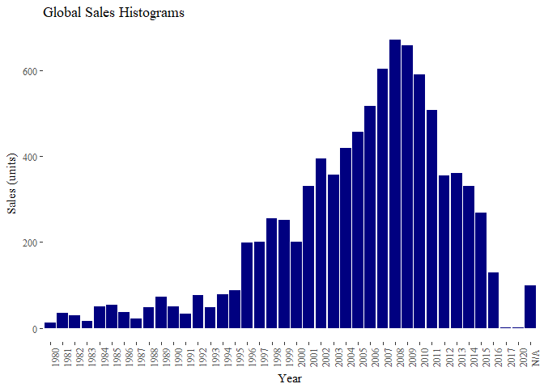
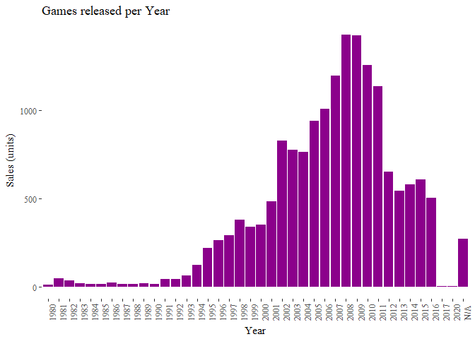

Introduction
------------

The dataset is from [Video Game
Sales](https://www.kaggle.com/gregorut/videogamesales) which was
generated by a scrape of vgchartz.com. There are over 16500 records.

Because the scraping algorithm focuses on game units sale, the data is
not the representation of modern gaming industry. The data also favors
consoles heavily since most big PC games follows free to play platform!

Nevetheless, this analysis should give us a glimpse at the change in
video game industry for the last 3 decades.

Variable Definitions:

1.  Name: Name of the game
2.  Platform: Console on which the game is running
3.  Year\_of\_Release: No description provided
4.  Genre: No description provided
5.  Publisher: No description provided
6.  NA\_Sales: Game sales in North America (in millions of units)
7.  EU\_Sales: Game sales in the European Union (in millions of units)
8.  JP\_Sales: Game sales in Japan (in millions of units)
9.  Other\_Sales: Game sales in the rest of the world, i.e. Africa, Asia
    excluding Japan, Australia, Europe excluding the E.U. and South
    America (in millions of units)
10. Global\_Sales: Total sales in the world (in millions of units)
11. Critic\_Score: Aggregate score compiled by Metacritic staff
12. Critic\_Count: The number of critics used in coming up with the
    Critic\_score
13. User\_Score: Score by Metacritic's subscribers
14. User\_Count: Number of users who gave the user\_score
15. Developer: Party responsible for creating the game
16. Rating: The ESRB ratings (E.g. Everyone, Teen, Adults Only..etc)

------------------------------------------------------------------------

Libraries and datasets
----------------------

    library(tidyverse)
    library(ggplot2)
    library(ggthemes)
    library(viridis)
    library(lubridate)
    library(wordcloud)
    library(qdap)
    library(tm)
    library(ngram)
    library(RColorBrewer)
    library(gridExtra)
    library(knitr)

    vgsales <- tbl_df(read.csv("vgsales.csv", stringsAsFactors = FALSE))
    theme_set(theme_tufte())

Exploratory Data Analysis
-------------------------

We start by taking a glimpse of general characteristics about the
dataset.

    str(vgsales)

    ## Classes 'tbl_df', 'tbl' and 'data.frame':    16719 obs. of  16 variables:
    ##  $ Name           : chr  "Wii Sports" "Super Mario Bros." "Mario Kart Wii" "Wii Sports Resort" ...
    ##  $ Platform       : chr  "Wii" "NES" "Wii" "Wii" ...
    ##  $ Year_of_Release: chr  "2006" "1985" "2008" "2009" ...
    ##  $ Genre          : chr  "Sports" "Platform" "Racing" "Sports" ...
    ##  $ Publisher      : chr  "Nintendo" "Nintendo" "Nintendo" "Nintendo" ...
    ##  $ NA_Sales       : num  41.4 29.1 15.7 15.6 11.3 ...
    ##  $ EU_Sales       : num  28.96 3.58 12.76 10.93 8.89 ...
    ##  $ JP_Sales       : num  3.77 6.81 3.79 3.28 10.22 ...
    ##  $ Other_Sales    : num  8.45 0.77 3.29 2.95 1 0.58 2.88 2.84 2.24 0.47 ...
    ##  $ Global_Sales   : num  82.5 40.2 35.5 32.8 31.4 ...
    ##  $ Critic_Score   : int  76 NA 82 80 NA NA 89 58 87 NA ...
    ##  $ Critic_Count   : int  51 NA 73 73 NA NA 65 41 80 NA ...
    ##  $ User_Score     : chr  "8" "" "8.3" "8" ...
    ##  $ User_Count     : int  322 NA 709 192 NA NA 431 129 594 NA ...
    ##  $ Developer      : chr  "Nintendo" "" "Nintendo" "Nintendo" ...
    ##  $ Rating         : chr  "E" "" "E" "E" ...

    colSums(is.na(vgsales))

    ##            Name        Platform Year_of_Release           Genre 
    ##               0               0               0               0 
    ##       Publisher        NA_Sales        EU_Sales        JP_Sales 
    ##               0               0               0               0 
    ##     Other_Sales    Global_Sales    Critic_Score    Critic_Count 
    ##               0               0            8582            8582 
    ##      User_Score      User_Count       Developer          Rating 
    ##               0            9129               0               0

There are quite a lot of missing values in score but they appear in
Sales which means a lot of games are neglected by the rating community.
It is worth our time to take a closer look at these titles in missing
values analysis.

#### General Histograms

    vgsales %>%
        group_by(Year_of_Release) %>%
        summarize(Sales = sum(Global_Sales, na.rm = TRUE)) %>%
        ggplot(aes(x = Year_of_Release, y = Sales)) +
        geom_col(fill = "navyblue") +
        theme(axis.text.x = element_text(angle = 90)) +
        labs(title = "Global Sales Histograms", x = "Year", y = "Sales (units)")

    vgsales %>%
        group_by(Year_of_Release) %>%
        summarize(Number_of_Games = n()) %>%
        ggplot(aes(x = Year_of_Release, y = Number_of_Games)) +
        geom_col(fill = "magenta4") +
        theme(axis.text.x = element_text(angle = 90)) +
        labs(title = "Games released per Year", x = "Year", y = "Sales (units)")

#### Top Global Sales each year

    vgsales %>%
        group_by(Year_of_Release, Publisher) %>%
        summarize(Sales = sum(Global_Sales)) %>%
        top_n(n = 1) %>%
        kable()

    ## Selecting by Sales

    ## Warning: package 'bindrcpp' was built under R version 3.4.1

<table>
<thead>
<tr class="header">
<th align="left">Year_of_Release</th>
<th align="left">Publisher</th>
<th align="right">Sales</th>
</tr>
</thead>
<tbody>
<tr class="odd">
<td align="left">1980</td>
<td align="left">Atari</td>
<td align="right">8.36</td>
</tr>
<tr class="even">
<td align="left">1981</td>
<td align="left">Activision</td>
<td align="right">8.50</td>
</tr>
<tr class="odd">
<td align="left">1982</td>
<td align="left">Atari</td>
<td align="right">19.43</td>
</tr>
<tr class="even">
<td align="left">1983</td>
<td align="left">Nintendo</td>
<td align="right">10.96</td>
</tr>
<tr class="odd">
<td align="left">1984</td>
<td align="left">Nintendo</td>
<td align="right">45.56</td>
</tr>
<tr class="even">
<td align="left">1985</td>
<td align="left">Nintendo</td>
<td align="right">49.95</td>
</tr>
<tr class="odd">
<td align="left">1986</td>
<td align="left">Nintendo</td>
<td align="right">16.18</td>
</tr>
<tr class="even">
<td align="left">1987</td>
<td align="left">Nintendo</td>
<td align="right">11.95</td>
</tr>
<tr class="odd">
<td align="left">1988</td>
<td align="left">Nintendo</td>
<td align="right">36.44</td>
</tr>
<tr class="even">
<td align="left">1989</td>
<td align="left">Nintendo</td>
<td align="right">63.88</td>
</tr>
<tr class="odd">
<td align="left">1990</td>
<td align="left">Nintendo</td>
<td align="right">35.49</td>
</tr>
<tr class="even">
<td align="left">1991</td>
<td align="left">Nintendo</td>
<td align="right">15.97</td>
</tr>
<tr class="odd">
<td align="left">1992</td>
<td align="left">Nintendo</td>
<td align="right">38.11</td>
</tr>
<tr class="even">
<td align="left">1993</td>
<td align="left">Nintendo</td>
<td align="right">20.04</td>
</tr>
<tr class="odd">
<td align="left">1994</td>
<td align="left">Nintendo</td>
<td align="right">24.99</td>
</tr>
<tr class="even">
<td align="left">1995</td>
<td align="left">Sony Computer Entertainment</td>
<td align="right">18.45</td>
</tr>
<tr class="odd">
<td align="left">1996</td>
<td align="left">Nintendo</td>
<td align="right">73.70</td>
</tr>
<tr class="even">
<td align="left">1997</td>
<td align="left">Sony Computer Entertainment</td>
<td align="right">43.90</td>
</tr>
<tr class="odd">
<td align="left">1998</td>
<td align="left">Nintendo</td>
<td align="right">48.41</td>
</tr>
<tr class="even">
<td align="left">1999</td>
<td align="left">Nintendo</td>
<td align="right">65.33</td>
</tr>
<tr class="odd">
<td align="left">2000</td>
<td align="left">Nintendo</td>
<td align="right">34.05</td>
</tr>
<tr class="even">
<td align="left">2001</td>
<td align="left">Nintendo</td>
<td align="right">45.37</td>
</tr>
<tr class="odd">
<td align="left">2002</td>
<td align="left">Electronic Arts</td>
<td align="right">73.01</td>
</tr>
<tr class="even">
<td align="left">2003</td>
<td align="left">Electronic Arts</td>
<td align="right">69.82</td>
</tr>
<tr class="odd">
<td align="left">2004</td>
<td align="left">Electronic Arts</td>
<td align="right">67.28</td>
</tr>
<tr class="even">
<td align="left">2005</td>
<td align="left">Nintendo</td>
<td align="right">126.69</td>
</tr>
<tr class="odd">
<td align="left">2006</td>
<td align="left">Nintendo</td>
<td align="right">204.42</td>
</tr>
<tr class="even">
<td align="left">2007</td>
<td align="left">Nintendo</td>
<td align="right">103.09</td>
</tr>
<tr class="odd">
<td align="left">2008</td>
<td align="left">Nintendo</td>
<td align="right">90.01</td>
</tr>
<tr class="even">
<td align="left">2009</td>
<td align="left">Nintendo</td>
<td align="right">127.39</td>
</tr>
<tr class="odd">
<td align="left">2010</td>
<td align="left">Electronic Arts</td>
<td align="right">80.26</td>
</tr>
<tr class="even">
<td align="left">2011</td>
<td align="left">Electronic Arts</td>
<td align="right">71.51</td>
</tr>
<tr class="odd">
<td align="left">2012</td>
<td align="left">Nintendo</td>
<td align="right">56.11</td>
</tr>
<tr class="even">
<td align="left">2013</td>
<td align="left">Nintendo</td>
<td align="right">53.48</td>
</tr>
<tr class="odd">
<td align="left">2014</td>
<td align="left">Nintendo</td>
<td align="right">48.88</td>
</tr>
<tr class="even">
<td align="left">2015</td>
<td align="left">Electronic Arts</td>
<td align="right">45.74</td>
</tr>
<tr class="odd">
<td align="left">2016</td>
<td align="left">Electronic Arts</td>
<td align="right">26.48</td>
</tr>
<tr class="even">
<td align="left">2017</td>
<td align="left">Sega</td>
<td align="right">0.05</td>
</tr>
<tr class="odd">
<td align="left">2020</td>
<td align="left">Ubisoft</td>
<td align="right">0.29</td>
</tr>
<tr class="even">
<td align="left">N/A</td>
<td align="left">Unknown</td>
<td align="right">20.90</td>
</tr>
</tbody>
</table>

### Missing Values Analysis

All missing values are in Critic Score, Critic Count and User Count.
However, Developer also has an empty string for these missing values.
Many of these titles are quite famous such as Super Mario Bros... thus
perhaps they were released before the rating website created. A simple
plot would suffice.

    vgsales$Year_of_Release <- as.integer(vgsales$Year_of_Release)
    vgsales %>%
        filter(is.na(Critic_Score)) %>%
        ggplot(aes(x = Year_of_Release, y = Genre)) +
        geom_jitter(alpha = 0.2, pch = 21, col = "darkslategrey") +
        labs(x = "Year of Release", title = "Missing Score by Genre and Year") 

It seems our intuition is wrong; most missing scores are from 2005 and
up. Nevertheless, there are a few interesting points show up in the
plot:

1.  Action, Adventure, Sport, Simulation and Misc have the most missing
    values. This trend correlated heavily with Genre distribution so it
    is not a surprise.
2.  There are 2 games from 1993 that have no Genres listed. They also
    have no name, created by Acclaim Entertainment for GEN gaming
    system. Their sales combine to a total of less than 2.5 millions.
    These will be excluded from our dataset.
3.  Imagine: Makeup Artist is/was/will be released in 2020 which proves
    time travel! Joking aside, it has already presale for $ 290.000
    total.
4.  Lastly, there are only 3 games from 2017 and we should also exclude
    them.

<!-- -->

    index <- which(vgsales$Genre == "" | vgsales$Year_of_Release %in% c(2020, 2017))
    vgsales <- vgsales[-index,]
    ## Creating System Variable
    pc <- c("PC")
    console <- c("Wii", "NES", "X360", "PS3", "PS2", "SNES", "PS4", "N64", "PS", "XB", "2600",
                 "XOne", "WiiU", "GC", "GEN", "DC", "SAT", "SCD", "NG", "TG16", "3DO", "GG", 
                 "PCFX")
    handheld <- c("GB", "DS", "GBA", "3DS", "PSP", "PSV", "WS")

    vgsales <- vgsales %>%
        mutate(System = ifelse(Platform %in% pc, "pc",
                               ifelse(Platform %in% console, "console", "handheld")))

    max_mis <- vgsales %>% filter(is.na(Critic_Score)) %>% 
        group_by(System) %>% filter(Global_Sales == max(Global_Sales))
    vgsales %>%
        filter(is.na(Critic_Score)) %>%
        ggplot(aes(x = Platform, y = Global_Sales, col = System)) +
        geom_point(alpha = 0.5, pch = 21) +
        geom_text(data = max_mis, label = max_mis$Name, vjust = "inward", hjust = "inward") +
        coord_flip() +
        labs(title = "Missing Score sorted by Global Sales and Platform")

Even with a missing score, these games still generate a healthy amount
of revenue with Super Mario Bros earned over 40 millions in sales. The
data shows no trend that any system got an edge in getting scored.

To conclude the missing values portion of this report, lets take a look
at the wordcloud.

    clean <- function(x){
        x <- replace_contraction(x)
        x <- replace_ordinal(x)
        x <- removePunctuation(x)
        x <- tolower(x)
        x <- removeWords(x, c(stopwords("en"), "game"))
    }
    missing <- filter(vgsales, is.na(Critic_Score))
    titles <- concatenate(missing$Name)
    titles <- clean(titles)
    unigram <- ngram(titles, n = 1)
    freq <- tbl_df(get.phrasetable(unigram))

    ## Creating wordcloud
    wordcloud(freq$ngrams, freq$freq, random.order = FALSE, rot.per = 0.35,
              color=brewer.pal(8, "Dark2"), max.words = 200)

There are a lot of sequels among these missing scores. Other words are
quite typical such as pro, world, soccer, portable, battle, gundam,
edition, championship...

### Sales vs Devs, Publisher and Platform

First, lets pay tribute to the people who make and distribute our games.

    vgsales %>%
        select(Publisher, Developer) %>%
        sapply(function(x) {length(unique(x))})

    ## Publisher Developer 
    ##       582      1697

    top20 <- head(names(sort(table(vgsales$Publisher), decreasing = TRUE)),20)
    p1 <- vgsales %>%
        filter(Publisher %in% top20) %>%
        mutate(Publisher = factor(Publisher, levels = rev(top20))) %>%
        group_by(Publisher) %>%
        summarize(Number_of_Devs = n_distinct(Developer)) %>%
        top_n(20, wt = Number_of_Devs) %>%
        ggplot(aes(x = Publisher, y = Number_of_Devs)) +
        geom_col(fill = "darkslategrey", alpha = 0.5) +
        coord_flip()
    p2 <- vgsales %>%
        filter(Publisher %in% top20) %>%
        mutate(Publisher = factor(Publisher, levels = rev(top20))) %>%
        group_by(Publisher) %>%
        summarize(Number_of_Games = n()) %>%
        top_n(20, wt = Number_of_Games) %>%
        ggplot(aes(x = Publisher, y = Number_of_Games)) +
        geom_col(fill = "firebrick4", alpha = 0.5) +
        coord_flip() +
        theme(axis.title.y = element_blank(), axis.text.y = element_blank())
    grid.arrange(p1,p2, ncol = 2, top = "Distribution of games and devs for top 20 Publishers")

There are a lot more Developers than Publishers. In fact, most big
Publishers have over 100 Developers working for them. Notice the Unknown
Publisher is in the top 20 also. Unknown here means the collection of
unrecorded publisher and not the name "Unknown".

The more interesting point is the massive amount of titles big
Publishers have compare to the rest. Even with only the top 20 we can
clearly see the big difference in distributive power. How about the
sale?

    toppub <- vgsales %>%
        filter(Publisher %in% c("Electronic Arts", "Activision", "Ubisoft", "Namco Bandai Games", "Nintendo")) %>%
        group_by(Publisher, Year_of_Release) %>%
        summarize(total = sum(Global_Sales))

    vgsales %>%
        group_by(Publisher, Year_of_Release) %>%
        summarize(total = sum(Global_Sales)) %>%
        ggplot(aes(x = Year_of_Release, y = total)) +
        geom_point(alpha = 0.5, pch = 21) +
        geom_point(data = toppub, aes(col = Publisher), size = 1.5) +
        geom_line(data = toppub, aes(col = Publisher), size = 1.3) +
        scale_color_viridis(discrete = TRUE) +
        theme(legend.position = c(0.2, 0.7)) +
        labs(title = "Time series of Global Sales by Publishers", y = "Sales (in million units)")

The sales distribution is amazing! The top 5 Publishers take home
multiple times the sales of the rest combined. While it is expected
given the distribution of game titles and developers, the plot shows how
hard it is to compete with these big buys in the industry.

EA and Ubisoft joined late but started to dominate the market very
quickly. Note that EA overtaked most of the competition by 2010.
However, their practice of buying out their competition is not very
popular with the fans.

[EA acquisitions
list](https://ipfs.io/ipfs/QmXoypizjW3WknFiJnKLwHCnL72vedxjQkDDP1mXWo6uco/wiki/List_of_acquisitions_by_Electronic_Arts.html)

[EA reddit
breakdown](http://nymag.com/selectall/2017/11/this-game-company-has-most-hated-comment-in-reddit-history.html)

    toppub <- vgsales %>%
        filter(Publisher %in% c("Electronic Arts", "Activision", "Ubisoft", "Namco Bandai Games", "Nintendo")) %>%
        gather("Region", "Sales", ends_with("Sales")) %>%
        group_by(Publisher, Year_of_Release, Region) %>%
        filter(Region != "Global_Sales") %>%
        summarize(total = sum(Sales))
    vgsales %>%
        gather("Region", "Sales", ends_with("Sales")) %>%
        group_by(Publisher, Year_of_Release, Region) %>%
        filter(Region != "Global_Sales") %>%
        summarize(total = sum(Sales)) %>%
        ggplot(aes(x = Year_of_Release, y = total)) +
        geom_point(alpha = 0.5, pch = 21) + 
        facet_wrap(~Region, scales = "free_y") +
        geom_point(data = toppub, aes(col = Publisher), size = 0.5) +
        geom_line(data = toppub, aes(col = Publisher), size = 1.1) +
        scale_color_viridis(discrete = TRUE) +
        theme(legend.position = "top", axis.title.x = element_blank()) +
        labs(title = "Time series of Global Sales by Publishers and Region", y = "Sales (in million units)")

When sorted through regions, sales distribution is the same for NA and
US. However, Nintendo and Manco Bandai Games are the only big players in
Japan market.

Moreover, NA an EU markets generates much more sales than Japan and
others - population matters here.

#### Notice there is a downward trend after 2010 in sales across the industry.

Reproducing the above decline using different dataset is reccomended to
reach any conclusion.

It is not a gaming analysis without system war. Three contenders are:
console, PC and handheld.

    vgsales %>%
        group_by(System, Year_of_Release) %>%
        summarize(total = sum(Global_Sales, na.rm = TRUE)) %>%
        ggplot(aes(x = Year_of_Release, y = total, fill = System)) +
        geom_col(position = "stack") +
        labs(y = "Sales (in million $)", title = "Global Sales by System and time") +
        scale_fill_viridis(discrete = TRUE)

This is a dangerous statistic. While the data clearly shows PC games
sales is practically nothing compared to the other two, remember most
revenue of PC games come from MOBA, RPG, ... which are free-to-play!

[PC generates more
revenue](https://hothardware.com/news/pc-gaming-six-times-more-revenue-than-consoles-in-2016)

Lets take a closer look at the console markets where there are three big
players: xbox, playstation, nintendo and others. The classification only
include the big names and gloat over many. However, it should still give
us a fair observation

    xbox <- c("X360", "XB", "XOne")
    nintendo <- c("Wii", "WiiU", "N64", "GC", "NES") 
    playstation <- c("PS", "PS2", "PS3", "PS4")

    vgsales %>%
        filter(System  == "console") %>%
        mutate(console_type = ifelse(Platform %in% xbox, "xbox",
                                     ifelse(Platform %in% nintendo, "nintendo", 
                                            ifelse(Platform %in% playstation, "playstation",
                                                   "others")))) %>%
        group_by(console_type, Year_of_Release) %>%
        summarize(total = sum(Global_Sales)) %>%
        ggplot(aes(x = Year_of_Release, fill = console_type)) +
        geom_density(position = "fill") +
        labs(title = "Distribution of game titles sorted by console type") +
        scale_fill_viridis(discrete = TRUE)

    vgsales %>%
        filter(System  == "console", Year_of_Release <= 2010) %>%
        mutate(console_type = ifelse(Platform %in% xbox, "xbox",
                                     ifelse(Platform %in% nintendo, "nintendo", 
                                            ifelse(Platform %in% playstation, "playstation",
                                                   "others")))) %>%
        group_by(console_type, Year_of_Release) %>%
        summarize(total = sum(Global_Sales)) %>%
        ggplot(aes(x = Year_of_Release, y = total, col = console_type)) +
        geom_point(alpha = 0.2) + 
        geom_line(alpha = 0.2) +
        stat_smooth(method = "lm", se = FALSE) +
        theme(legend.position = c(0.2, 0.7)) +
        labs(title = "Console sales before 2010 across console platform", y = "Sales (in units)") +
        scale_color_viridis(discrete = TRUE)

    vgsales %>%
        filter(System  == "console", Year_of_Release > 2010) %>%
        mutate(console_type = ifelse(Platform %in% xbox, "xbox",
                                     ifelse(Platform %in% nintendo, "nintendo", 
                                            ifelse(Platform %in% playstation, "playstation",
                                                   "others")))) %>%
        group_by(console_type, Year_of_Release) %>%
        summarize(total = sum(Global_Sales)) %>%
        ggplot(aes(x = Year_of_Release, y = total, col = console_type)) +
        geom_point(alpha = 0.2) + 
        geom_line(alpha = 0.2) +
        stat_smooth(method = "lm", se = FALSE) +
        labs(title = "Console sales after 2010 across console platform", y = "Sales (in units)") +
        scale_color_viridis(discrete = TRUE)

Few observations:

1.  Nintendo was the only big player before 1995 and thus they had a
    complete control over the market
2.  After 1995, Xbox and playstation gained the majority of market
    shares
3.  There are only 3 big players in console in the last 20 years, all
    others are going extinct.
4.  Again we see a sharp decline in sales after 2010

Sales vs Genre and Rating
-------------------------

If you are not familiar with games rating, here is the short version.
Note that we have an empty string which means missing value for one of
the rating category

AO - Adult only 18+ M - Mature Only 17+ T - Teen E10+ - Everyone 10+ E -
Everyone EC - Early Childhood RP - Rating Pending

    vgsales %>%
        ggplot(aes(x = Rating, y = Genre, col = Genre)) +
        geom_jitter(alpha = 0.4, pch = 21) +
        theme(legend.position = "none") +
        scale_color_viridis(discrete = TRUE)

There are many games without rating. In contrast, most Publisher avoids
K-A, EC and AO rating since the playerbase is too specific. Genre is not
affected by time as much.

    vgsales %>%
        group_by(Genre, Name) %>%
        summarise(Sales = sum(Global_Sales)) %>%
        top_n(n = 1) %>%
        kable()

    ## Selecting by Sales

<table>
<thead>
<tr class="header">
<th align="left">Genre</th>
<th align="left">Name</th>
<th align="right">Sales</th>
</tr>
</thead>
<tbody>
<tr class="odd">
<td align="left">Action</td>
<td align="left">Grand Theft Auto V</td>
<td align="right">56.57</td>
</tr>
<tr class="even">
<td align="left">Adventure</td>
<td align="left">Assassin's Creed</td>
<td align="right">11.27</td>
</tr>
<tr class="odd">
<td align="left">Fighting</td>
<td align="left">Super Smash Bros. Brawl</td>
<td align="right">12.84</td>
</tr>
<tr class="even">
<td align="left">Misc</td>
<td align="left">Wii Play</td>
<td align="right">28.92</td>
</tr>
<tr class="odd">
<td align="left">Platform</td>
<td align="left">Super Mario Bros.</td>
<td align="right">45.31</td>
</tr>
<tr class="even">
<td align="left">Puzzle</td>
<td align="left">Tetris</td>
<td align="right">35.84</td>
</tr>
<tr class="odd">
<td align="left">Racing</td>
<td align="left">Mario Kart Wii</td>
<td align="right">35.52</td>
</tr>
<tr class="even">
<td align="left">Role-Playing</td>
<td align="left">Pokemon Red/Pokemon Blue</td>
<td align="right">31.37</td>
</tr>
<tr class="odd">
<td align="left">Shooter</td>
<td align="left">Call of Duty: Black Ops</td>
<td align="right">30.82</td>
</tr>
<tr class="even">
<td align="left">Simulation</td>
<td align="left">Nintendogs</td>
<td align="right">24.67</td>
</tr>
<tr class="odd">
<td align="left">Sports</td>
<td align="left">Wii Sports</td>
<td align="right">82.53</td>
</tr>
<tr class="even">
<td align="left">Strategy</td>
<td align="left">Pokemon Stadium</td>
<td align="right">5.45</td>
</tr>
</tbody>
</table>

Lastly, lets take a look at how different regions favor different genre.

    vgsales %>%
        gather("Region", "Value", c("NA_Sales", "EU_Sales", "JP_Sales", "Other_Sales")) %>%
        group_by(Region, Genre) %>%
        summarize(Sales = sum(Value)) %>%
        top_n(n = 3) %>%
        ggplot(aes(x = Region, y = Sales, group = Region, fill = Genre)) +
        geom_col(position = "stack") +
        scale_fill_viridis(discrete = TRUE) +
        labs(title = "Top Genre by Sales per Region")

    ## Selecting by Sales

Lastly, lets take a look at the Name wordcloud

    names <- concatenate(vgsales$Name)
    names <- clean(names)

    unigram <- ngram(names, n = 1)
    freqs <- get.phrasetable(unigram)
    wordcloud(freqs$ngrams, freqs$freq, random.order = FALSE, rot.per = 0.35,
              color=brewer.pal(8, "Dark2"), max.words = 100)

Final Notes
-----------

1.  Game sales peaked in 2008 and has been decreasing ever since.
    However, the data is not a representation of overall gaming scene.
    Modern games focus on free to play platform, dominated by PC games.
2.  The data is flawed since it only takes into account game sales where
    most revenue from games comes from microtransactions. Again, we did
    not have the data to show PC games on the rise.
3.  EA, Nintendo, Sony are the last few big companies can manage to
    survive
4.  Most bad games die out instantly in the last few years which signify
    the rise in standard of games.
5.  The analysis focuses on consoles due to the data structure.
